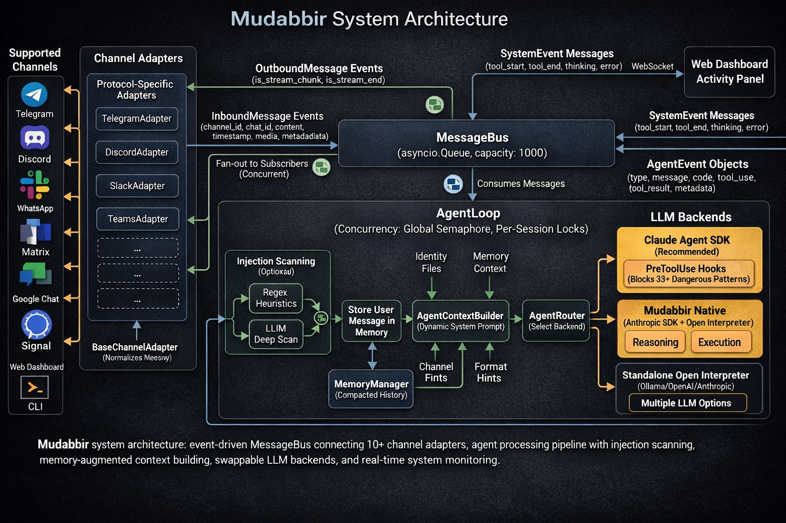
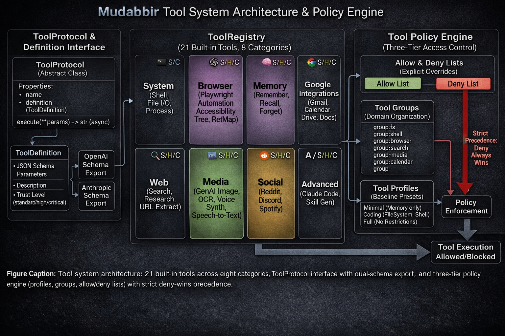
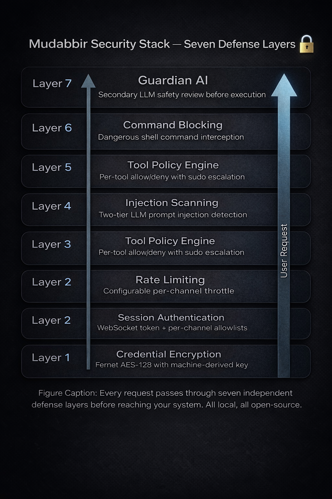
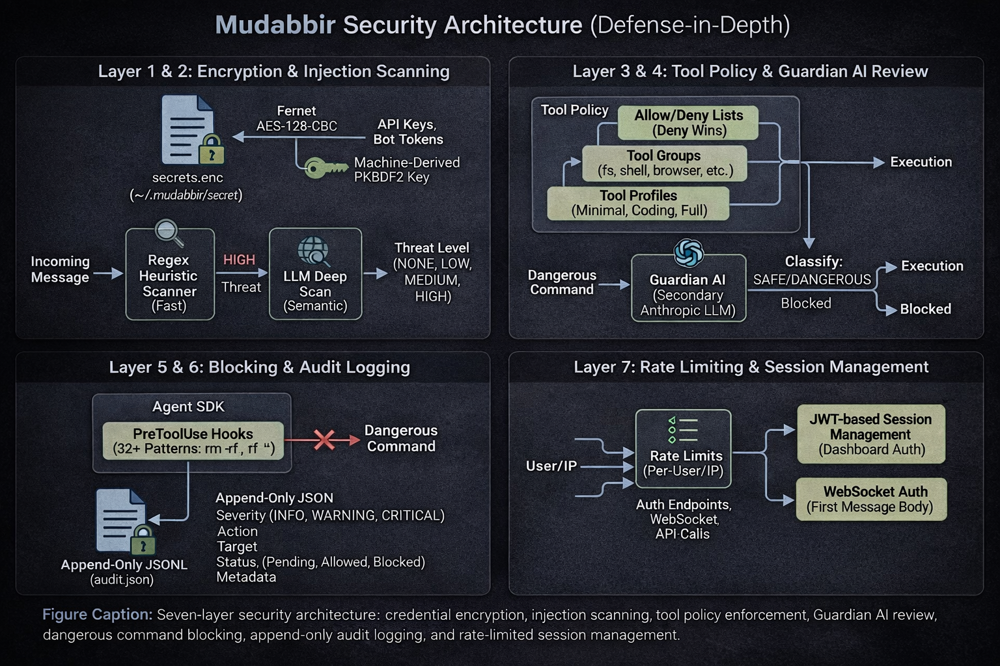

<p align="center">
  
</p>

<h1 align="center">Mudabbir</h1>

<p align="center">
  <strong>An AI agent that runs on your machine, not someone else's.</strong>
</p>

<p align="center">
  <a href="https://pypi.org/project/mudabbir/"></a>
  <a href="https://opensource.org/licenses/MIT"></a>
  <a href="https://www.python.org/downloads/"></a>
  <a href="https://github.com/Ahmed5754/mudabbir/releases"></a>
  <a href="https://github.com/Ahmed5754/mudabbir/stargazers"></a>
</p>

<p align="center">
  👤 <a href="CODE_OF_CONDUCT.md"><strong>Who Am I? | من أنا؟</strong></a>
</p>

<p align="center">
  <a href="https://github.com/Ahmed5754/mudabbir/releases/latest/download/Mudabbir-macOS-arm64.dmg"></a>
  &nbsp;
  <a href="https://github.com/Ahmed5754/mudabbir/releases/latest/download/Mudabbir-Setup.exe"></a>
</p>

<p align="center">
  Self-hosted, multi-agent AI platform. Web dashboard + <strong>Discord</strong>, <strong>Slack</strong>, <strong>WhatsApp</strong>, <strong>Telegram</strong>, and more.<br>
  No subscription. No cloud lock-in. Just you and your Paw.
</p>

> **🚧 Beta:** This project is under active development. Expect breaking changes between versions.

---

## Quick Start

```bash
curl -fsSL https://mudabbir.fly.dev/install.sh | sh
```

If your Linux shell shows parsing errors (for example `: not found` or `set: Illegal option -`), use:

```bash
curl -fsSL https://mudabbir.fly.dev/install.sh | tr -d '\r' | sh
```

Or install directly:

```bash
pip install Mudabbir && mudabbir
```

**That's it.** One command. 30 seconds. Your own AI agent.

I'm your self-hosted, cross-platform personal AI agent. The web dashboard opens automatically. Talk to me right in your browser, or connect me to Discord, Slack, WhatsApp, or Telegram and control me from anywhere. I run on _your_ machine, respect _your_ privacy, and I'm always here.

**No subscription. No cloud lock-in. Just you and me.**

<details>
<summary>More install options</summary>

```bash
# Isolated install
pipx install mudabbir && mudabbir

# Run without installing
uvx mudabbir

# From source
git clone https://github.com/Ahmed5754/mudabbir.git
cd mudabbir
uv run mudabbir
```

</details>

Mudabbir will open the web dashboard in your browser and be ready to go.
No config files. No YAML. No dependency hell.

**Talk to your agent from anywhere:**
Telegram · Discord · Slack · WhatsApp · Web Dashboard

---

## Docker

Run Mudabbir in a container — great for servers, VPS, or always-on setups.

```bash
# Clone the repo
git clone https://github.com/Ahmed5754/mudabbir.git
cd mudabbir

# Copy and fill in your env vars
cp .env.example .env

# Start the dashboard
docker compose up -d
```

Dashboard is at `http://localhost:8888`. Log in with the access token:

```bash
docker exec mudabbir cat /home/mudabbir/.mudabbir/access_token
```

<details>
<summary>Optional services (Ollama, Qdrant)</summary>

```bash
# With Ollama for local LLM inference
docker compose --profile ollama up -d

# With Qdrant for mem0 vector memory
docker compose --profile qdrant up -d

# Both
docker compose --profile ollama --profile qdrant up -d
```

When using Ollama inside Docker, set `MUDABBIR_OLLAMA_HOST=http://ollama:11434` in your `.env` so Mudabbir reaches the Ollama container by service name.

</details>

Data persists in a named Docker volume across restarts. See [`.env.example`](.env.example) for all available configuration options.

---

## What Can Mudabbir Do?

| Feature | Description |
| --- | --- |
| **Web Dashboard** | Browser-based control panel, the default mode. No setup needed. |
| **Multi-Channel** | Discord, Slack, WhatsApp (Personal + Business), Signal, Matrix, Teams, Google Chat, Telegram |
| **Claude Agent SDK** | Default backend. Official Claude SDK with built-in tools (Bash, Read, Write). |
| **Smart Model Router** | Optional auto-selection of Haiku / Sonnet / Opus based on task complexity (off by default — Claude Code has its own routing) |
| **Tool Policy** | Allow/deny control over which tools the agent can use |
| **Plan Mode** | Require approval before the agent runs shell commands or edits files |
| **Browser Control** | Browse the web, fill forms, click buttons via accessibility tree |
| **Gmail Integration** | Search, read, and send emails via OAuth (no app passwords) |
| **Calendar Integration** | List events, create meetings, meeting prep briefings |
| **Google Drive & Docs** | List, download, upload, share files; read and create documents |
| **Web Search & Research** | Tavily/Brave search + multi-step research with source synthesis |
| **Image Generation** | Google Gemini image generation, saved locally |
| **Voice / TTS / STT** | Text-to-speech via OpenAI or ElevenLabs, speech-to-text via Whisper |
| **Spotify** | Search tracks, playback control, playlist management |
| **Reddit** | Search posts, read threads, browse trending topics |
| **OCR** | Extract text from images via GPT-4o vision or pytesseract |
| **Memory & Compaction** | Long-term facts + session history with smart compaction + Mem0 semantic search |
| **MCP Support** | Connect Model Context Protocol servers (stdio + HTTP) |
| **Cron Scheduler** | Recurring reminders with natural language time parsing |
| **Security Suite** | Injection scanner, audit CLI, Guardian AI, self-audit daemon |
| **Local-First** | Runs on YOUR machine. Your data never leaves your computer. |
| **Cross-Platform** | macOS, Windows, Linux |
| **Skill System** | Create reusable agent skills at runtime |
| **Task Delegation** | Delegate complex sub-tasks to Claude Code CLI |

### Examples

```
You:  "Every Sunday evening, remind me which recycling bins to put out"
Paw:  *creates a recurring schedule*
Paw:  "Done. I'll check the recycling calendar and message you every Sunday at 6pm."

You:  "Organize my Downloads folder. PDFs by date, images by type, delete duplicates"
Paw:  *scans filesystem, moves 47 files, removes 12 duplicates*
Paw:  "All clean. Here's what I did: [summary]"
```

### Research & Browsing

```
You:  *drops a link*
Paw:  *opens browser, reads the page, researches related topics*
Paw:  "Here's a summary with 3 key takeaways. Want me to save this to memory?"
```

### Coding & DevOps

```
You:  "Find that memory leak, the app crashes after 2 hours"
Paw:  *reads logs, profiles code, identifies the issue*
Paw:  "Found it. The WebSocket handler never closes connections. Here's the fix."
```

### Multi-Agent Workflows (Mission Control)

```
You:  "I need a competitor analysis report for our product launch"
Paw:  *spins up Agent A: web researcher, Agent B: data analyst, Agent C: writer*
Paw:  "3 agents working on it. Agent A is scraping competitor sites,
       Agent B is analyzing pricing data, Agent C is waiting to write the report.
       I'll ping you when it's ready."
```

---

## Web Dashboard

The browser-based dashboard is the default mode. Run `mudabbir` and it opens at `http://localhost:8888`.

What you get:

- Real-time streaming chat via WebSocket
- Session management: create, switch, search, and resume conversations
- Activity panel showing tool calls, thinking, and system events
- Settings panel for LLM, backend, and tool policy configuration
- Channel management: configure, start, and stop adapters from the sidebar
- MCP server management: add, configure, and monitor MCP servers
- Plan Mode approval modal for reviewing tool calls before execution

### Channel Management

All configured channel adapters auto-start on launch. Use the sidebar "Channels" button to:

- Configure tokens and credentials per channel
- Start/stop adapters dynamically
- See running status at a glance

Headless mode is also available for running without the dashboard:

```bash
mudabbir --discord              # Discord only
mudabbir --slack                # Slack only
mudabbir --whatsapp             # WhatsApp only
mudabbir --discord --slack      # Multiple channels
mudabbir --telegram             # Legacy Telegram mode
```

See [Channel Adapters documentation](documentation/features/channels.md) for full setup guides.

---

## Browser

Uses your existing Chrome if you have it. No extra downloads. If you don't have Chrome, a small browser is downloaded automatically on first use.

---

## Windows Skills Coverage (31-39 + AI)

Mudabbir now includes a large Windows desktop skillset covering your requested categories:

- `31. Background Apps Skills`: `background_tools` (`count_background`, `list_minimized_windows`, `list_visible_windows`, `ghost_apps`, `activity_time`, `network_usage_per_app`, `camera_usage_now`, `mic_usage_now`, `wake_lock_apps`, `process_paths`)
- `32. Startup Skills`: `startup_tools` (`list`, `impact_breakdown`, `disable`, `enable`, `registry_startups`, `folder_startups`, `detect_new`, `watch_new_live`, `signature_check`, `full_audit`)
- `33. Resource Monitoring`: `performance_tools` (`top_cpu`, `top_ram`, `top_disk`, `total_cpu_percent`, `total_ram_percent`, `cpu_clock`, `available_ram`, `top_gpu_processes`, `gpu_temp`, `pagefile_used`, `disk_io_rate`)
- `34. App Killing & Cleaning`: `process_tools` (`kill_name`, `kill_pid`, `kill_unresponsive`, `kill_high_cpu`, `close_browsers`, `close_office`, `restart_explorer`) + `maintenance_tools` (`empty_ram`)
- `35. Deep System Info`: `hardware_tools` + `info_tools` + `driver_tools` + `update_tools` (`cores_info`, `ram_speed_type`, `mobo_model`, `battery_minutes`, `battery_cycle_count`, `drivers_issues`, `windows_install_date`, `last_update_time`)
- `36. Advanced UI Skills`: `window_control` (`set_focus`, `transparency`, `borderless_on/off`, `disable_close_on/off`, `minimize_to_tray`, `span_all_screens`, `move_resize`)
- `37. Security Awareness`: `security_tools` (`logged_in_users`, `recent_files`, `recent_files_clear`, `current_connections_ips`, `firewall_status`, `admin_processes`, `failed_audit_logins`, `intrusion_summary`, `remote_sessions_list`, `close_remote_sessions`)
- `38. Smart Utilities`: `text_tools`, `search_tools`, `screenshot_tools`, `automation_tools`, `ui_tools`, `service_tools` (`clipboard_to_file`, `search_open_windows_content`, screenshot-to-path, timer, mouse lock/region, anti-idle F5, battery guard, screen-off mouse lock, `refresh_rate`, `user_services`, `game_mode_on/off`)
- `39. Dev Integration`: `dev_tools` (`open_editor`, `env_vars`, `runtime_versions`, `git_last_log`, `create_batch` via `text_tools`) + `interpret_powershell`
- `AI Add-ons`: `vision_tools` (screen description + OCR), `threat_tools` (`behavior_scan`, `vt_lookup`, file hash), `file_tools` semantic organization and smart content rename, `content_tools` (email/Word drafts + text-to-Excel)

---

## Architecture

<p align="center">
  
</p>

### Agent Backends

- **Claude Agent SDK (Default, Recommended).** Anthropic's official SDK with built-in tools (Bash, Read, Write, Edit, Glob, Grep, WebSearch). Supports `PreToolUse` hooks for dangerous command blocking.
- **Mudabbir Native.** Custom orchestrator: Anthropic SDK for reasoning + Open Interpreter for code execution.
- **Open Interpreter.** Standalone, supports Ollama, OpenAI, or Anthropic. Good for fully local setups with Ollama.

Switch anytime in settings or config.

<details>
<summary>Tool System Architecture</summary>
<br>
<p align="center">
  
</p>
</details>

---

## Memory System

### File-based Memory (Default)

Stores memories as readable markdown in `~/.Mudabbir/memory/`:

- `MEMORY.md`: Long-term facts about you
- `sessions/`: Conversation history with smart compaction

### Session Compaction

Long conversations are automatically compacted to stay within budget:

- **Recent messages** kept verbatim (configurable window)
- **Older messages** compressed to one-liner extracts (Tier 1) or LLM summaries (Tier 2, opt-in)

### USER.md Profile

Mudabbir creates identity files at `~/.Mudabbir/identity/` including `USER.md`, a profile loaded into every conversation so the agent knows your preferences.

### Optional: Mem0 (Semantic Memory)

For smarter memory with vector search and automatic fact extraction:

```bash
pip install Mudabbir[memory]
```

See [Memory documentation](documentation/features/memory.md) for details.

---

## Configuration

Config lives in `~/.Mudabbir/config.json`. API keys and tokens are automatically encrypted in `secrets.enc`, never stored as plain text.

```json
{
  "agent_backend": "claude_agent_sdk",
  "claude_sdk_model": "",
  "claude_sdk_max_turns": 25,
  "anthropic_api_key": "sk-ant-...",
  "anthropic_model": "claude-sonnet-4-5-20250929",
  "tool_profile": "full",
  "memory_backend": "file",
  "smart_routing_enabled": false,
  "plan_mode": false,
  "injection_scan_enabled": true,
  "self_audit_enabled": true,
  "web_search_provider": "tavily",
  "tts_provider": "openai"
}
```

Or use environment variables (all prefixed with `MUDABBIR_`):

```bash
# Core
export MUDABBIR_ANTHROPIC_API_KEY="sk-ant-..."
export MUDABBIR_AGENT_BACKEND="claude_agent_sdk"

# Channels
export MUDABBIR_DISCORD_BOT_TOKEN="..."
export MUDABBIR_SLACK_BOT_TOKEN="xoxb-..."
export MUDABBIR_SLACK_APP_TOKEN="xapp-..."

# Integrations
export MUDABBIR_GOOGLE_OAUTH_CLIENT_ID="..."
export MUDABBIR_GOOGLE_OAUTH_CLIENT_SECRET="..."
export MUDABBIR_TAVILY_API_KEY="..."
export MUDABBIR_GOOGLE_API_KEY="..."
```

See the [full configuration reference](documentation/features/) for all available settings.

---

## Security

<p align="center">
  
</p>

- **Guardian AI.** A secondary LLM reviews every shell command before execution and decides if it's safe.
- **Injection Scanner.** Two-tier detection (regex heuristics + optional LLM deep scan) blocks prompt injection attacks.
- **Tool Policy.** Restrict agent tool access with profiles (`minimal`, `coding`, `full`) and allow/deny lists.
- **Plan Mode.** Require human approval before executing shell commands or file edits.
- **Security Audit CLI.** Run `mudabbir --security-audit` to check 7 aspects (config permissions, API key exposure, audit log, etc.).
- **Self-Audit Daemon.** Daily automated health checks (12 checks) with JSON reports at `~/.Mudabbir/audit_reports/`.
- **Audit Logging.** Append-only log at `~/.Mudabbir/audit.jsonl`.
- **Single User Lock.** Only authorized users can control the agent.
- **File Jail.** Operations restricted to allowed directories.
- **Local LLM Option.** Use Ollama and nothing phones home.

<details>
<summary>Detailed security architecture</summary>
<br>
<p align="center">
  
</p>
</details>

See [Security documentation](documentation/features/security.md) for details.

---

## Development

```bash
# Clone
git clone https://github.com/Ahmed5754/mudabbir.git
cd mudabbir

# Install with dev dependencies
uv sync --dev

# Run the dashboard with auto-reload (watches *.py, *.html, *.js, *.css)
uv run mudabbir --dev

# Run tests
uv run pytest

# Lint
uv run ruff check .

# Format
uv run ruff format .
```

### Optional Extras

```bash
pip install Mudabbir[discord]             # Discord support
pip install Mudabbir[slack]               # Slack support
pip install Mudabbir[whatsapp-personal]   # WhatsApp Personal (QR scan)
pip install Mudabbir[image]               # Image generation (Google Gemini)
pip install Mudabbir[memory]             # Mem0 semantic memory
pip install Mudabbir[matrix]              # Matrix support
pip install Mudabbir[teams]               # Microsoft Teams support
pip install Mudabbir[gchat]               # Google Chat support
pip install Mudabbir[mcp]                 # MCP server support
pip install Mudabbir[all]                 # Everything
```

---

## Documentation

Full documentation lives in [`documentation/`](documentation/README.md):

- [Channel Adapters](documentation/features/channels.md): Discord, Slack, WhatsApp, Telegram setup
- [Tool Policy](documentation/features/tool-policy.md): Profiles, groups, allow/deny
- [Web Dashboard](documentation/features/web-dashboard.md): Browser UI overview
- [Security](documentation/features/security.md): Injection scanner, audit CLI, audit logging
- [Model Router](documentation/features/model-router.md): Smart complexity-based model selection
- [Plan Mode](documentation/features/plan-mode.md): Approval workflow for tool execution
- [Integrations](documentation/features/integrations.md): OAuth, Gmail, Calendar, Drive, Docs, Spotify
- [Tools](documentation/features/tools.md): Web search, research, image gen, voice, delegation, skills
- [Memory](documentation/features/memory.md): Session compaction, USER.md profile, Mem0
- [Scheduler](documentation/features/scheduler.md): Cron scheduler, self-audit daemon

---

## Follow us

<!-- TODO: Add Product Hunt badge once page is live -->
<!-- [](https://www.producthunt.com/posts/mudabbir) -->

- Twitter: Coming Soon
- Discord: Coming Soon
- Email: 0a1h2m3e4d5123321@gmail.com
- Telegram
- Developer: [@K_6_3](https://t.me/K_6_3)
- Discussion Group: [@MudabbirAi](https://t.me/MudabbirAi)

PRs welcome. Come build with us.

---

## License

MIT &copy; [Ahmed Muhammad](https://t.me/K_6_3)

<p align="center">
  
  <br>
  <strong>Made with love for humans who want AI on their own terms</strong>
</p>
